# 🚀 Distributed Job Executor

A distributed job execution platform built using **Java, Spring Boot, PostgreSQL, and Microservices**.

The application distributes asynchronous jobs among multiple worker nodes using a **Round Robin Load Balancer** while continuously monitoring worker health using periodic heartbeats. Failed jobs are automatically retried and eventually moved to a Dead Letter Queue after exceeding the retry limit.

---

# 📖 Table of Contents

- Overview
- Features
- System Architecture
- Job Lifecycle
- Technology Stack
- Project Structure
- Workflow
- REST APIs
- Database Schema
- Screenshots
- Running the Project
- Future Enhancements
- Learning Outcomes

---

# 🎯 Overview

Modern distributed systems separate job submission from job execution. Instead of executing long-running tasks synchronously, jobs are submitted to a controller, assigned to available workers, executed asynchronously, and tracked throughout their lifecycle.

This project demonstrates the core building blocks of a distributed job execution platform including:

- Distributed worker registration
- Health monitoring using heartbeats
- Round Robin load balancing
- Job scheduling
- Retry mechanism
- Dead Letter Queue
- Dashboard metrics
- Microservices communication

---

# ✨ Features

## Controller Service

- Submit Jobs
- Retrieve Job Details
- Register Workers
- Receive Worker Heartbeats
- Detect Offline Workers
- Round Robin Load Balancer
- Automatic Job Assignment Scheduler
- Dashboard API
- Retry Failed Jobs
- Dead Letter Queue

---

## Worker Service

- Auto Registration
- Periodic Heartbeats
- Poll Assigned Jobs
- Execute Jobs
- Report Job Status
- Retry Support

---

# 🏗 System Architecture

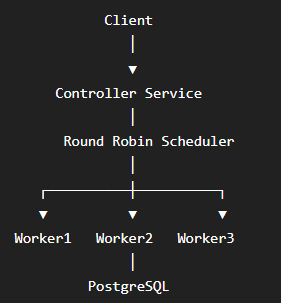

---

# 🔄 Job Lifecycle

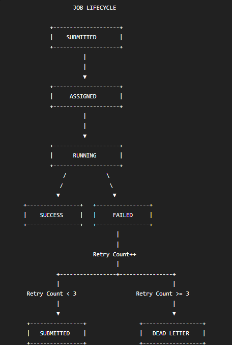

---

# ⚙ Technology Stack

| Technology | Purpose |
|------------|---------|
| Java 21 | Programming Language |
| Spring Boot | Backend Framework |
| Spring Data JPA | ORM |
| PostgreSQL | Database |
| Gradle | Build Tool |
| REST APIs | Service Communication |
| Spring Scheduler | Background Jobs |
| Lombok | Boilerplate Reduction |

---

# 📂 Project Structure

```
distributed-job-executor
│
├── controller-service
│   ├── controller
│   ├── dto
│   ├── entity
│   ├── enums
│   ├── exception
│   ├── repository
│   ├── scheduler
│   ├── service
│   └── ControllerServiceApplication
│
├── worker-service
│   ├── config
│   ├── dto
│   ├── service
│   ├── startup
│   ├── scheduler
│   └── WorkerServiceApplication
│
└── README.md
```

---

# 🔄 System Workflow

## Step 1 – Submit Job

Client submits a new job.

```
POST /jobs
```

Controller stores the job with status

```
SUBMITTED
```

---

## Step 2 – Worker Registration

When a Worker Service starts, it automatically registers itself.

```
POST /workers/register
```

Controller stores

- Worker ID
- Host
- Port
- Capacity
- Registration Time

---

## Step 3 – Heartbeat

Every worker sends heartbeat periodically.

```
POST /workers/heartbeat
```

Controller updates

- Last Heartbeat
- Updated Time
- Worker Status

Offline workers are automatically detected if heartbeats stop.

---

## Step 4 – Job Assignment

A scheduled task periodically scans all submitted jobs.

```
Every 10 seconds
```

Jobs are assigned using a **Round Robin Load Balancer**.

Example

```
Job 1 → Worker 1

Job 2 → Worker 2

Job 3 → Worker 3

Job 4 → Worker 1
```

---

## Step 5 – Job Polling

Worker periodically polls the controller.

```
GET /jobs/next/{workerId}
```

Controller returns one assigned job.

---

## Step 6 – Job Execution

Worker executes the job.

If successful

```
SUCCESS
```

Otherwise

```
FAILED
```

---

## Step 7 – Retry

When a job fails

```
Retry Count++
```

If

```
Retry Count < 3
```

Job becomes

```
SUBMITTED
```

Otherwise

```
DEAD_LETTER
```

---

# 📡 REST APIs

## Jobs

| Method | Endpoint | Description |
|---------|----------|-------------|
| POST | /jobs | Submit Job |
| GET | /jobs/{id} | Get Job Details |
| GET | /jobs/next/{workerId} | Poll Next Job |
| POST | /jobs/status | Update Job Status |

---

## Workers

| Method | Endpoint | Description |
|---------|----------|-------------|
| POST | /workers/register | Register Worker |
| POST | /workers/heartbeat | Send Heartbeat |

---

## Dashboard

| Method | Endpoint | Description |
|---------|----------|-------------|
| GET | /dashboard | Dashboard Metrics |

---

# 💾 Database Design

## workers

| Column |
|---------|
| id |
| worker_name |
| host |
| port |
| status |
| active_jobs |
| total_jobs_executed |
| last_heartbeat |
| registered_at |
| updated_at |

---

## jobs

| Column |
|---------|
| id |
| job_type |
| payload |
| status |
| retry_count |
| worker_id |
| assigned_at |
| created_at |
| updated_at |

---

# 📸 Screenshots

## Project Structure

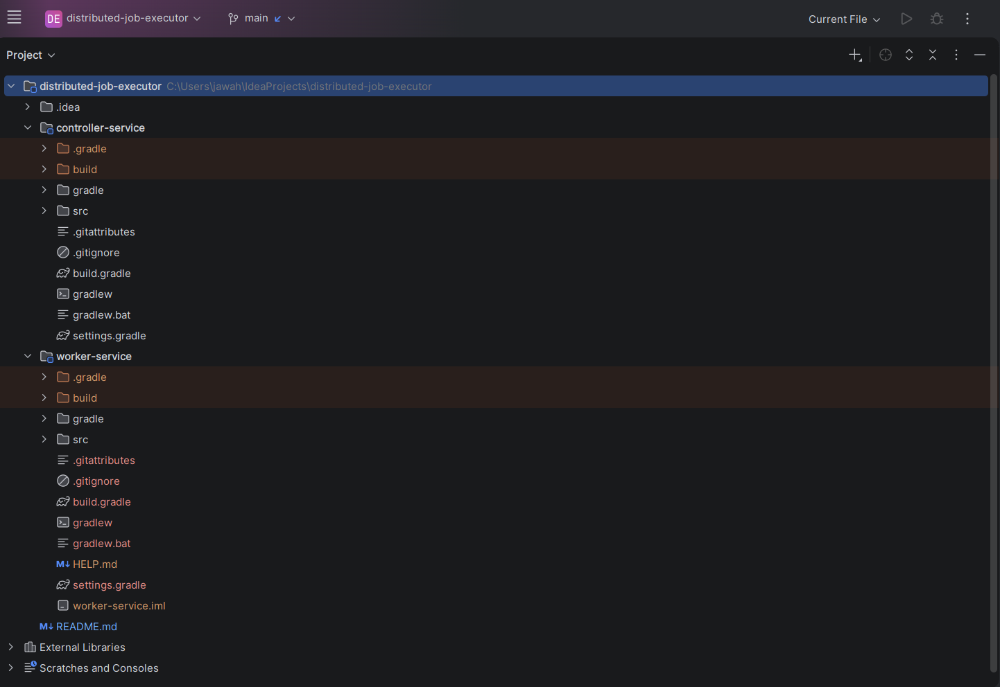

---

## Worker Registration

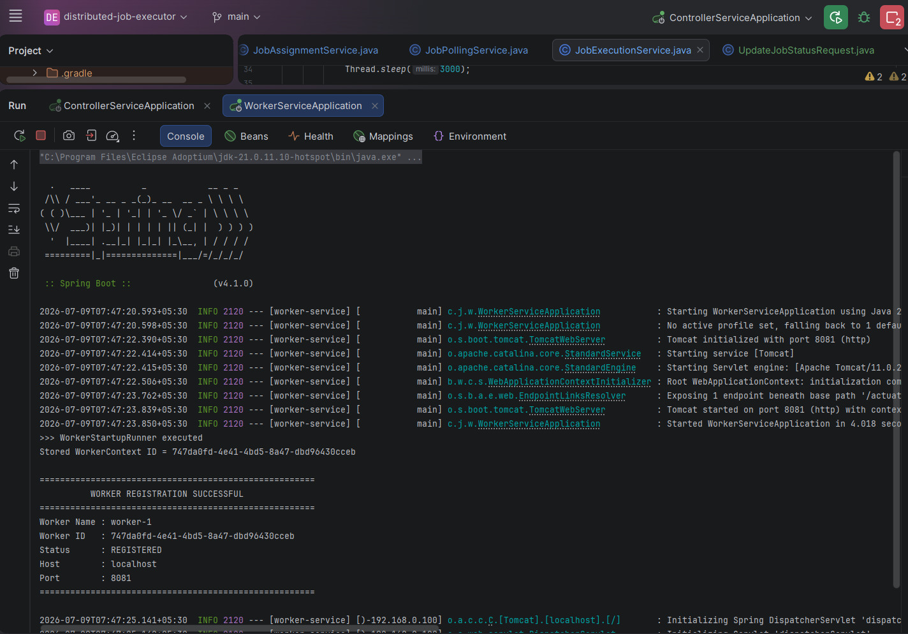

---

## Heartbeats

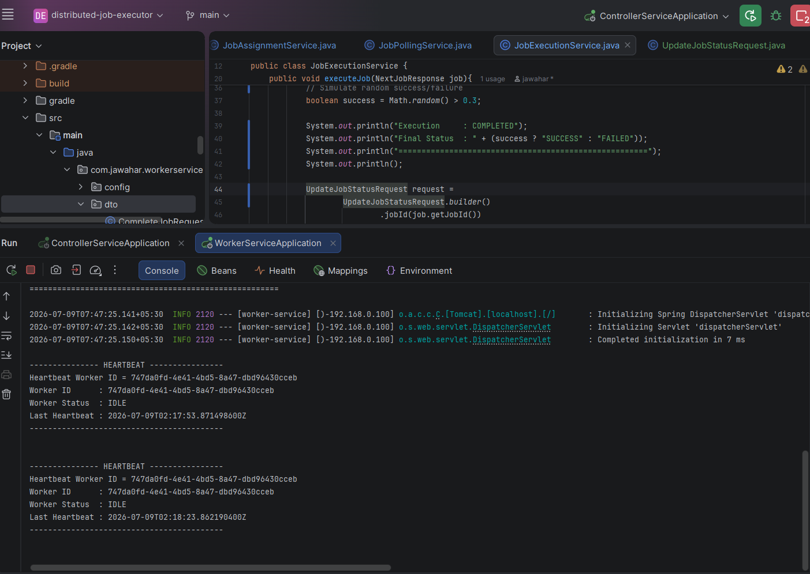

---

## Job Assignment

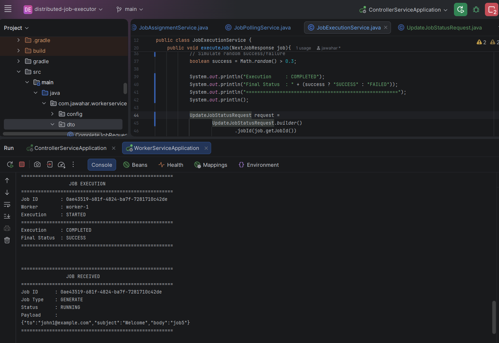

---

## Job Execution

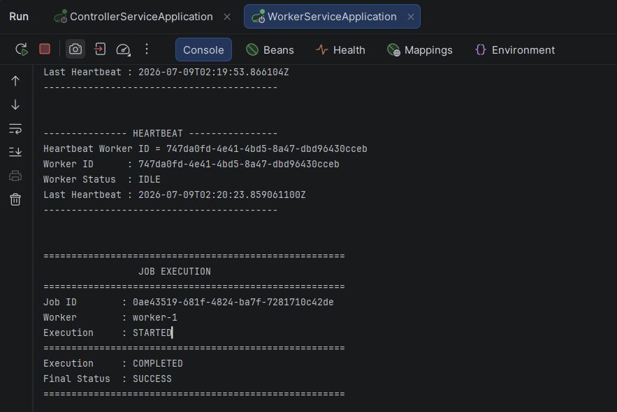

---

## Dashboard

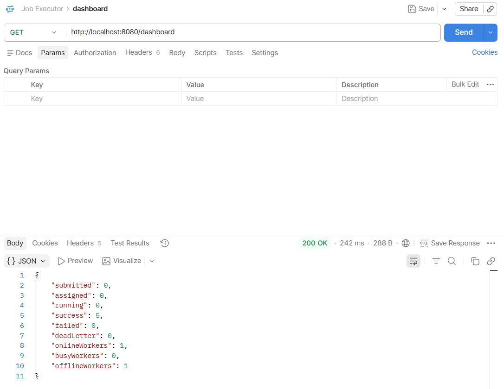

---

## Workers Table

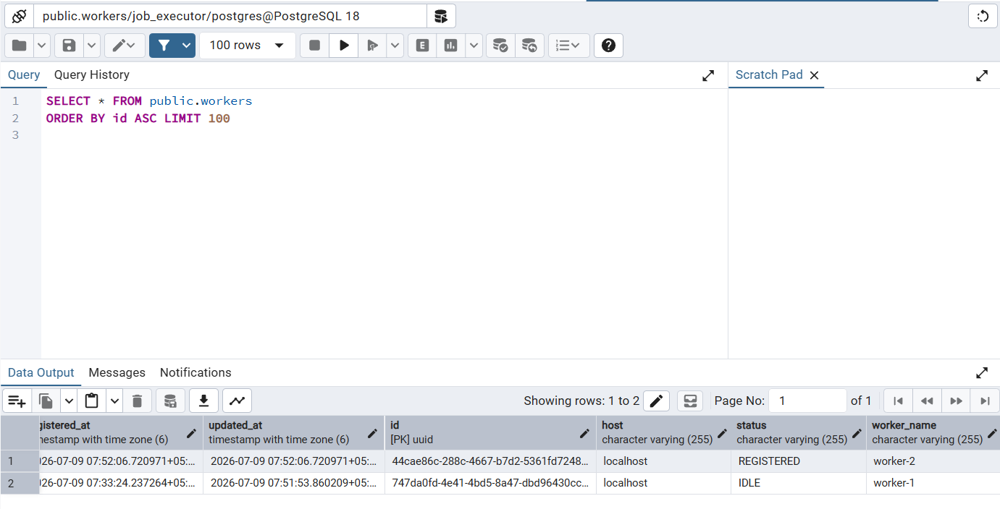

---

## Jobs Table

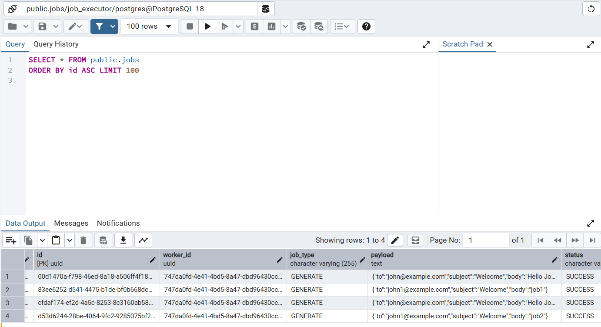

---

## Multiple Worker Consoles

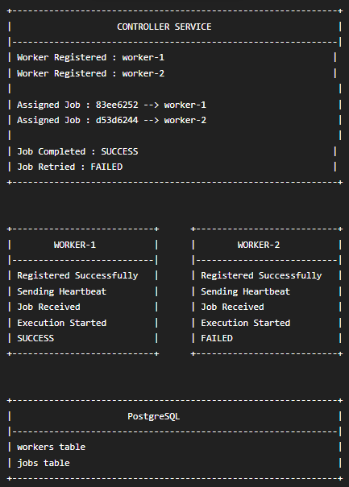

---

# ▶ Running the Project

## Clone Repository

```bash
git clone https://github.com/<YOUR_USERNAME>/distributed-job-executor.git
```

---

## Create Database

```
job_executor
```

---

## Start Controller Service

```bash
cd controller-service

./gradlew bootRun
```

---

## Start Worker Service

```bash
cd worker-service

./gradlew bootRun
```

---

## Submit Jobs

Use the Postman collection available in this repository.

---

# 🚀 Future Enhancements

- Docker
- Apache Kafka
- Redis
- RabbitMQ
- Kubernetes
- Prometheus
- Grafana
- JWT Authentication
- AWS Deployment
- Dynamic Worker Scaling
- Distributed Locking

---

# 📚 Learning Outcomes

This project demonstrates practical implementation of:

- Distributed Systems
- Microservices
- REST APIs
- Spring Boot
- Spring Scheduling
- PostgreSQL
- Worker Registration
- Heartbeat Monitoring
- Round Robin Load Balancing
- Retry Mechanism
- Dead Letter Queue
- Backend System Design

---

# 👨‍💻 Author

**Jawahar M**

Full Stack Developer

- Java
- Spring Boot
- Microservices
- PostgreSQL
- Distributed Systems

If you found this project useful, consider giving it a ⭐ on GitHub.